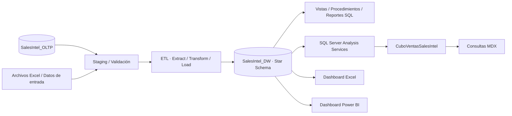
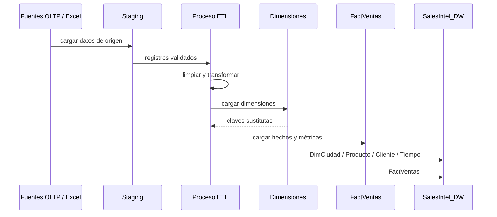
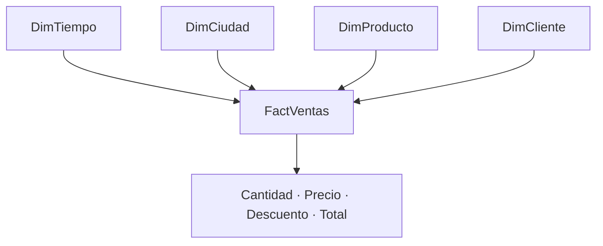
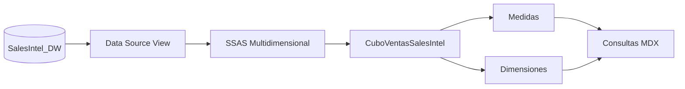
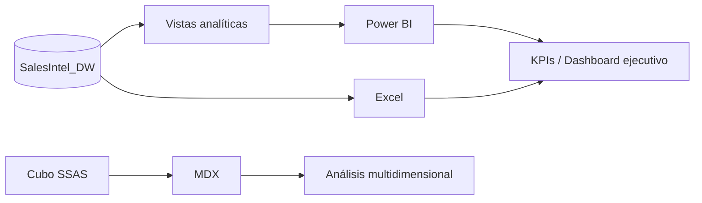
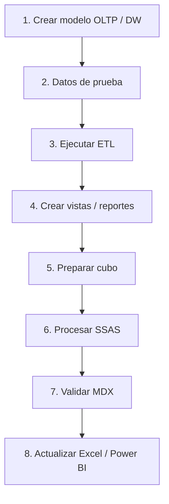

# Arquitectura de SalesIntel DW

SalesIntel DW implementa una arquitectura clásica de **Business Intelligence**: datos transaccionales de origen, proceso ETL, Data Warehouse con esquema estrella, capa analítica multidimensional y herramientas de consumo para reportes y dashboards.

## Vista general

La fuente transaccional no se consulta directamente para análisis multidimensional. El ETL transforma los datos hacia un modelo diseñado para lectura analítica y preserva una separación clara entre operación y reporting.

## Flujo ETL

## Modelo dimensional

El esquema estrella reduce complejidad de consulta y facilita el consumo desde SSAS, Excel y Power BI.

## Capa multidimensional

## Capa de consumo

## Componentes principales

| Componente | Responsabilidad |
|---|---|
| `SalesIntel_OLTP` | Modelo transaccional de origen |
| Staging | Recepción, limpieza y validación previa de datos |
| ETL | Extracción, transformación, claves sustitutas y carga |
| `SalesIntel_DW` | Data Warehouse analítico |
| Dimensiones | Ciudad, Producto, Cliente y Tiempo |
| `FactVentas` | Métricas de ventas y claves dimensionales |
| SSAS | Motor multidimensional |
| `CuboVentasSalesIntel` | Cubo OLAP de ventas |
| MDX | Consultas multidimensionales |
| Excel | Dashboard analítico |
| Power BI | Dashboard interactivo y KPIs |

## Orden técnico de construcción

## Criterio de evolución

El diseño debe mantener separados el modelo transaccional y el analítico. Si el volumen o frecuencia de carga aumentan, la evolución natural sería automatizar orquestación ETL, incrementalidad y calidad de datos antes de introducir nuevas herramientas de visualización.
